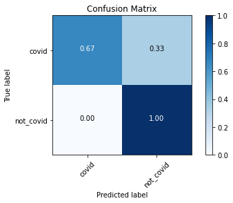

# COVID-19 Cough Classification using PyTorch

## Overview

The aim of this project is to classify audio recordings of coughs into COVID-19 positive and negative.

## Installation

### Install required libraries

```
pip install -r requirements.txt
```

### Download dataset from kaggle

The dataset used for training and evaluation can be found on kaggle:<br/>
https://www.kaggle.com/himanshu007121/coughclassifier-trial<br/>
Download and extract the content of the zip file into the ./data/ directory.

## Running the code

The code is split into four notebooks:

1. [001_prepare_data.ipynb](001_prepare_data.ipynb): This notebook extracts the features of the wav files and writes them to a new csv file.
2. [002_training.ipynb](002_training.ipynb): Trains and evaluates the CoughNet using the extracted features. Finally a checkpoint is saved.
3. [003_inference.ipynb](003_inference.ipynb): Uses the saved checkpoint to predict on an input wav file. There is also a [pretrained checkpoint](checkpoints/) available.
4. [004_k_fold_cross_validation.ipynb](004_k_fold_cross_validation.ipynb): K-fold Cross Validation for objective evaluation.

## Results

The complete dataset is split into 4 folds and evaluated using cross validation.<br/>
The model converges after 20 epochs of training.

|         | Train Accuracy | Test Accuracy |
| ------- | -------------: | ------------: |
| Fold 0  |       100.00 % |       95.35 % |
| Fold 1  |       100.00 % |       97.67 % |
| Fold 2  |       100.00 % |       97.62 % |
| Fold 3  |       100.00 % |       92.86 % |
| Average |       100.00 % |       95.87 % |

## Problems

The major problem with this dataset is, that it is highly unbalanced. Only 19 of the 170 examples are labeled as positive. <br/>
Therefore, in addition to the good test accuracy, the model shows a relatively high false-negative rate. <br/>
More data, especially positive examples, is needed to develop a reliable, cough audio-based Covid-19 test. <br/>



## Credits

The PyTorch implementation is based on a Keras notebook by Himanshu which can be found here:
https://www.kaggle.com/himanshu007121/covid-19-cough-classification
